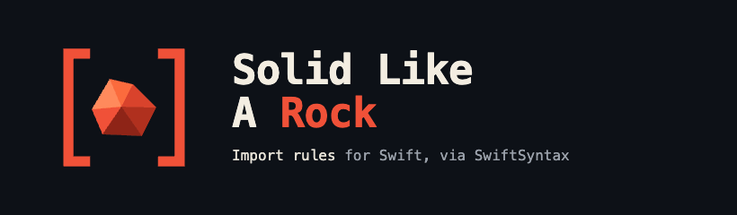
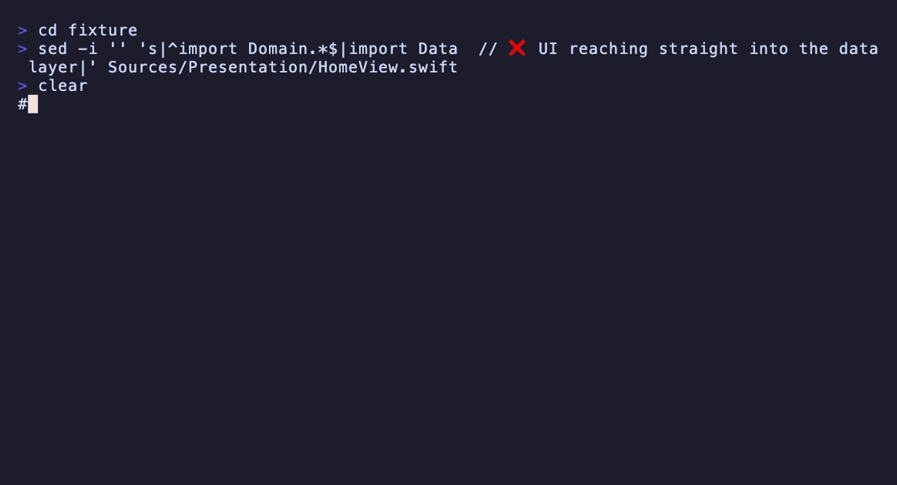
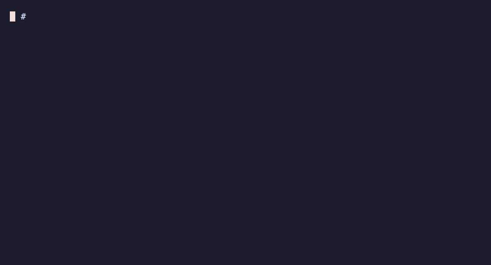

<p align="center">
  
</p>

<p align="center">
  <a href="https://github.com/nenadvulic/solid-like-a-rock/actions/workflows/ci.yml"></a>
  <a href="https://github.com/nenadvulic/solid-like-a-rock/releases/latest"></a>
  <a href="https://swiftpackageindex.com/nenadvulic/solid-like-a-rock"></a>
  <a href="LICENSE"></a>
</p>

# SolidLikeARock

**AI agents can generate code faster than humans can review it.**

One forbidden import slips into a PR today — `UIKit` in the network layer, a
ViewModel reaching straight into a data toolkit. Nobody catches it in review.
One architectural violation today becomes a hundred tomorrow, and your Clean
Architecture ends up a diagram on a wiki that the code stopped following
months ago.

SolidLikeARock is an **architectural guardrail for Swift**: it enforces your
import rules on every build and every PR, so architectural drift is caught the
moment it appears — whether the code was written by a human or generated by an
AI agent:

```
Sources/Presentation/HomeView.swift:5: error: SolidLikeARock: layer 'Presentation' must not import 'Data'
```

<p align="center">
  
</p>

Under the hood it is a tiny, dependency-light Swift CLI that parses each
`.swift` file with [SwiftSyntax](https://github.com/swiftlang/swift-syntax)
(a real syntax tree — no fragile regex / `grep`), finds every `import`
statement, figures out which architectural layer the file belongs to, and
fails if a layer imports something it shouldn't. Swift architecture validation
as a build step: a practical way to enforce the **Dependency Inversion
Principle** (the *D* in SOLID) and Clean Architecture boundaries in CI —
dependencies must point inward.

```
Domain  <-  Data  <-  Presentation
        (dependencies point inward)
```

It completes the tools you already run, rather than replacing them:

| Tool | Purpose |
|------|---------|
| [SwiftLint](https://github.com/realm/SwiftLint) | Style rules |
| [Periphery](https://github.com/peripheryapp/periphery) | Dead code |
| **SolidLikeARock** | Architecture rules |

## Why now?

AI coding assistants can generate code faster than humans can review it.

The challenge is no longer writing code.

The challenge is ensuring that generated code conforms to your architecture.

SolidLikeARock acts as an architectural guardrail: it enforces your import rules on every build and every PR, so no AI-generated shortcut silently collapses your layers.

## Install

**Homebrew (recommended):**

```bash
brew tap nenadvulic/solid-like-a-rock
brew install solid-like-a-rock
```

**From source:**

```bash
git clone https://github.com/nenadvulic/solid-like-a-rock.git
cd solid-like-a-rock
swift build -c release
cp .build/release/solid-like-a-rock /usr/local/bin/
```

Or run without installing:

```bash
swift run solid-like-a-rock --config .solid.yml Sources
```

## Generate a config (`init`)

Writing `.solid.yml` by hand on an existing project is tedious. `init` generates
a starter config by analysing the project's **real inter-module import graph** —
deterministic, no LLM. It emits one layer per local module; you regroup/rename
them into business layers afterwards.

```bash
# Freeze the current architecture (best for legacy adoption):
solid-like-a-rock init --freeze ./MyApp

# Heuristic layering proposal, to review:
solid-like-a-rock init ./MyApp

# Multi-package project with a non-standard modules directory:
solid-like-a-rock init --packages-dir Modules .

# TCA (The Composable Architecture) project — groups into Models/Dependencies/Features/App:
solid-like-a-rock init --tca ./MyTCAApp
```

- **`--freeze`** — for each module, deny every *other* local module it doesn't
  import today. Result: **zero violations now**, and the linter bites the moment
  a **new** cross-module dependency appears. The fastest way onto a living codebase.

<p align="center">
  
</p>

- **default (heuristic)** — ranks modules by depth in the import graph and denies
  only *outward* dependencies (toward more-outer layers). More permissive; review it.

It auto-detects the layout (`Packages/<M>/Sources` or `Sources/<M>`), scans only
sources (never `Tests/`), ignores system/third-party imports, and writes a sorted,
deterministic, commented file. It won't overwrite an existing file without `--force`.

## Generate a config with AI

If `init` doesn't cover your project layout — or you want a more tailored starting
point — paste the prompt below into any AI assistant. It works for both SPM and
plain Xcode/CocoaPods projects.

> If you already ran `init`, paste its output alongside the prompt — the AI will
> use it as a starting point and refine the layer groupings.

```
I want to set up solid-like-a-rock (https://github.com/nenadvulic/solid-like-a-rock),
a Swift architecture linter. Please generate a .solid.yml config file for my project.

1. Explore the source directory structure (list folders up to 3 levels deep).
2. Sample `import` statements from Swift files in each main folder to understand
   real dependencies.
3. Identify the architectural layers (Domain, Data, Presentation, Application, etc.)
   from the folder names and import patterns.
4. Generate a .solid.yml with:
   - `exclude` for .build/, Pods/, checkouts/, Tests/
   - `alwaysAllow` for the system frameworks found in the imports
   - One layer per architectural group, with `paths` globs and `deny`/`allow` rules
     that enforce inward-pointing dependencies
   - Use `dependencyOrder` if the project has clearly ordered layers
5. Add a comment with the run command and the --write-baseline command for first use.

My project is at: [PATH]
```

Replace `[PATH]` with your project root. If you already ran `solid-like-a-rock init`,
paste its output at the end of the prompt.

> **Xcode / CocoaPods projects (no SwiftPM modules):** `init` requires a SwiftPM
> module structure to build the import graph. Plain Xcode targets are not
> discoverable, so the command will report *no local modules found*. Write
> `.solid.yml` by hand instead — map your source folders as layers and use
> `deny` lists to enforce the boundaries you care about:
>
> ```yaml
> exclude:
>   - /Pods/
>   - /.build/
>
> alwaysAllow:
>   - Foundation
>   - UIKit
>   - SwiftUI
>   - Combine
>
> layers:
>   - name: Domain
>     paths: [MyApp/Domain/**]
>     allow: [Foundation]
>
>   - name: Data
>     paths: [MyApp/Data/**]
>     deny: [UIKit, SwiftUI]   # Data must never reach into the UI
>
>   - name: Presentation
>     paths: [MyApp/Presentation/**]
>     deny: [NetworkProvider, DataStore]   # UI goes through the Domain, not Data
> ```
>
> Run it against your source tree:
>
> ```bash
> solid-like-a-rock --config .solid.yml MyApp
> ```
>
> If the project already has violations, capture a baseline first so CI only
> fails on *new* ones:
>
> ```bash
> solid-like-a-rock --write-baseline .solid-baseline.json --config .solid.yml MyApp
> solid-like-a-rock --baseline .solid-baseline.json --config .solid.yml MyApp
> ```

## Configure

Create a `.solid.yml` at your project root (or generate one with [`init`](#generate-a-config-init)) — see the included example:

```yaml
# Skip dependencies and build artefacts (substring match on the full path).
exclude:
  - /.build/
  - /Pods/
  - checkouts

alwaysAllow:
  - Foundation
  - Combine

layers:
  - name: Domain
    paths: [Sources/Domain]
    allow: [Foundation]          # whitelist: ONLY these may be imported

  - name: Presentation
    paths: [Sources/Presentation]
    deny: [Data]                 # blacklist: never import Data here
```

- **`allow` (whitelist)** — the layer may import *only* these modules. Anything
  else (besides `alwaysAllow` and the layer's own name) is a violation. Use this
  for strict inner layers like `Domain`.
- **`deny` (blacklist)** — these modules are forbidden; everything else is fine.
  Use this for "this layer must not reach across to that one" rules.
- A file is assigned to the **first** layer whose `paths` glob matches it, so
  list more specific paths first. `paths` are **globs** (`*` within a segment,
  `**` across segments, `?` one char), aligned on path-component boundaries — so
  `Sources/Domain` matches `Sources/Domain/...` but never `Sources/DomainHelpers`.
- **`exclude`** drops any file whose path contains one of these fragments before
  layer matching — essential for monorepos that vendor dependencies (`.build`,
  `Pods`, SwiftPM `checkouts`). You can also pass them on the CLI:
  `solid-like-a-rock --exclude .build Pods -- Sources`.

### Layered mode (`dependencyOrder`)

In a multi-module SPM project a layer often spans several modules. Declare them
with `modules:` (defaults to `[name]`), then declare the layer order **once**
and let the tool derive the rules — no hand-written allow/deny per layer:

```yaml
# innermost first; dependencies may point inward, never outward
dependencyOrder: [Domain, Application, Infrastructure, Presentation]

layers:
  - name: Domain
    modules: [DomainModels, DomainServices]   # one layer, several modules
    paths:   [Sources/Domain/**, Sources/DomainServices/**]

  - name: Presentation
    modules: [UIToolkit, Booking, Search]
    paths:   [Sources/Presentation/**]
    deny:    [NetworkProvider]   # stricter exception on top of the order
```

A module that belongs to a **more-outer** layer than the file's own layer is an
*outward dependency* and fails. Rules resolve in this order:

1. `alwaysAllow` → allowed
2. same layer (intra-layer import) → allowed
3. explicit **`deny`** → violation (forces it, even on an inward import);
   explicit **`allow`** → allowed (exempts it, even from an outward violation)
4. `dependencyOrder`: importing a more-outer layer → violation
5. a module in no layer (third-party framework) → allowed by default

`allow`/`deny` keep working on their own when `dependencyOrder` is unset (the
v0.1.0 behaviour), so existing configs are unchanged. A module may belong to at
most one layer, and every `dependencyOrder` name must match a declared layer —
both are checked before linting.

### Visibility rule (`visibility`)

Opt-in: flag top-level `public`/`open` declarations living in **leaf modules**
— local modules that no other module imports. Either the module is a product
for external consumers (exclude it) or those symbols should be `internal`:

```yaml
visibility:
  warnPublicInLeafModules: true
  excludeModules: [MyPublicSDK]   # vended to external consumers — skipped
  severity: warning               # default; set `error` to fail the build
```

```
Sources/Utils/Helper.swift:1: warning: SolidLikeARock: module 'Utils' is not imported by any other module, but declares public symbol 'Helper' — make it internal, or exclude the module
```

Module-level only, by design: deciding whether a *specific* public symbol is
unused requires type information — that's [Periphery](https://github.com/peripheryapp/periphery)'s
job. Executable modules (`main.swift` / `@main`) are skipped automatically,
and violations are baselineable like any other.

## Run

```bash
solid-like-a-rock Sources
```

Output uses the `file:line: error: message` format, so violations show up
inline in Xcode and in CI logs:

```
Sources/Domain/User.swift:3: error: SolidLikeARock: layer 'Domain' is not allowed to import 'UIKit'
Sources/Presentation/HomeView.swift:5: error: SolidLikeARock: layer 'Presentation' must not import 'Data'
❌ SolidLikeARock: 2 violation(s) found.
```

Exit code is non-zero when violations are found — drop it straight into a CI step
or an Xcode "Run Script" build phase.

## Adopting on a living codebase

Three features make it realistic to switch the linter on for a project that
already has violations, without fixing everything on day one.

### Baseline — fail only on *new* violations

Record the current violations once, then have CI fail only on ones introduced
afterwards:

```bash
# snapshot today's violations (run once, commit the file)
solid-like-a-rock --write-baseline .solid-baseline.json Sources

# from now on, only NEW violations are reported and fail the build
solid-like-a-rock --baseline .solid-baseline.json Sources
```

A violation's identity is `file + module + reason` — the line number is
excluded, so editing code above an import doesn't resurface a baselined entry as
"new". The baseline file is plain, sorted JSON: diff-friendly and safe to commit.

<p align="center">
  
</p>

### Inline suppressions — `// solid:ignore <reason>`

For a deliberate, justified exception, annotate the import. The **reason is
mandatory** (a bare `// solid:ignore` does nothing):

```swift
import UIKit // solid:ignore needed for the legacy bridge, removed in #1234
```

The directive also works on the line directly above the import. SolidLikeARock
reads it from the syntax tree's trivia, so it's matched on the real `import`, not
by text scanning.

### Severity — warn without failing the build

Give a layer `severity: warning` to surface its violations as warnings (reported,
but the build still passes). Default is `error`.

```yaml
layers:
  - name: Presentation
    paths: [Sources/Presentation/**]
    deny: [NetworkProvider]
    severity: warning      # report, don't fail (yet)
```

Diagnostics use the matching keyword (`… warning: …` / `… error: …`), and the
process exits non-zero only when at least one **error**-level violation remains.

## Integrate into an existing project

### Xcode — Run Script build phase

Select your app target → **Build Phases** → **+** → **New Run Script Phase**,
then paste:

```bash
if command -v solid-like-a-rock >/dev/null; then
  solid-like-a-rock --config "$SRCROOT/.solid.yml" "$SRCROOT/Sources"
else
  echo "warning: solid-like-a-rock not installed — skipping architecture lint"
fi
```

Because the output uses the `file:line: error:` format, violations show up as
**red errors inline in the editor** and fail the build. Drop the `command -v`
guard if you'd rather make the tool mandatory for everyone.

Xcode will warn that the phase "will be run during every build because it does
not specify any outputs" — that's exactly what you want for a linter. Silence it
by unchecking **"Based on dependency analysis"** on the phase (it then runs every
build, as intended).

Prefer it as a separate, run-on-demand step instead of part of the app build?
Make it a dedicated **aggregate target** (`+` under TARGETS → *Aggregate*) with
the same Run Script phase, and build that scheme to lint.

#### Zero-install variant (auto-download a pinned binary)

If you don't want every contributor to install the tool, have the build phase
fetch a pinned release binary into a gitignored cache. Add a
`scripts/lint-architecture.sh` to your repo:

```bash
#!/usr/bin/env bash
set -euo pipefail

VERSION="v0.7.0"
# Universal binary (arm64 + x86_64) since v0.4.2 — no arch detection needed.

ROOT="$(cd "$(dirname "${BASH_SOURCE[0]}")/.." && pwd)"
BIN="$ROOT/.tools/solid-like-a-rock-$VERSION"

if [[ ! -x "$BIN" ]]; then
  mkdir -p "$ROOT/.tools"; tmp="$(mktemp -d)"
  url="https://github.com/nenadvulic/solid-like-a-rock/releases/download/$VERSION/solid-like-a-rock-macos-universal.tar.gz"
  if ! curl -fsSL "$url" -o "$tmp/slr.tar.gz" 2>/dev/null; then
    echo "warning: could not download solid-like-a-rock — skipping architecture lint"; exit 0
  fi
  tar -xzf "$tmp/slr.tar.gz" -C "$tmp"; mv "$tmp/solid-like-a-rock" "$BIN"; chmod +x "$BIN"
fi

exec "$BIN" --config "$ROOT/.solid.yml" "$ROOT/Sources"
```

Then point the Run Script phase at it — `"${SRCROOT}/../scripts/lint-architecture.sh"`
(adjust the relative path to your layout). Add `.tools/` to `.gitignore`.

> Two gotchas: the binary is pinned to a version and cached, so the network is
> only hit once (subsequent builds are offline). And if Xcode's
> `ENABLE_USER_SCRIPT_SANDBOXING` is `YES`, that first download is blocked —
> run the script once from a terminal to seed the cache, or set it to `NO` for
> the target.

### CI — GitHub Action (easiest)

```yaml
- uses: nenadvulic/solid-like-a-rock-action@v1
  with:
    paths: Sources
```

See [solid-like-a-rock-action](https://github.com/nenadvulic/solid-like-a-rock-action) for all inputs (`version`, `config`, `baseline`).

### CI — download the released binary

Each tagged release publishes a prebuilt macOS binary, so CI doesn't pay the
SwiftSyntax build cost:

```yaml
# .github/workflows/architecture.yml
name: Architecture
on: [push, pull_request]
jobs:
  lint:
    runs-on: macos-15
    steps:
      - uses: actions/checkout@v4
      - name: Install solid-like-a-rock
        run: |
          curl -fsSL -o slr.tar.gz \
            https://github.com/nenadvulic/solid-like-a-rock/releases/latest/download/solid-like-a-rock-macos-universal.tar.gz
          tar -xzf slr.tar.gz && sudo mv solid-like-a-rock /usr/local/bin/
      - name: Lint import boundaries
        run: solid-like-a-rock --reporter github --config .solid.yml Sources
```

`--reporter github` emits `::error file=…,line=…::` workflow commands, so each
violation shows up as an **inline annotation** on the pull request (not just in
the log). Reporters: `text` (default, Xcode/CI-friendly `file:line: error:`),
`json` (tooling/Danger), `github` (PR annotations). `--format`/`-f` is a kept alias.

### CI — run from source, nothing to install

If your project is already a SwiftPM package (or you just want it for free in
CI), build and run the tool straight from a checkout — no binary to manage:

```bash
git clone --depth 1 https://github.com/nenadvulic/solid-like-a-rock /tmp/slr
swift run --package-path /tmp/slr solid-like-a-rock --config .solid.yml Sources
```

Either way the non-zero exit code fails the job, so a layer violation blocks the
merge the same way a failing test would.

### SwiftPM command plugin (zero-install)

If your project is a SwiftPM package, add SolidLikeARock as a dependency and run
the bundled **command plugin** — nothing to install, and it works the same
locally and in CI:

```swift
// your Package.swift
dependencies: [
    .package(url: "https://github.com/nenadvulic/solid-like-a-rock", from: "0.7.0"),
],
```

```bash
swift package solid-lint --config .solid.yml Sources
# or, with the conventional layout (.solid.yml at the package root + Sources/):
swift package solid-lint
```

The plugin runs read-only and exits non-zero when violations are found, so it
drops straight into a CI step.

### SwiftPM build-tool plugin (lint on every build)

For SwiftPM targets, apply the **build-tool plugin** to lint automatically as a
prebuild step on every `swift build` (and in Xcode) — violations appear inline,
no separate run-script. It uses a prebuilt binary from the release artifactbundle,
so no compile-from-source cost:

```swift
// your Package.swift
dependencies: [
    .package(url: "https://github.com/nenadvulic/solid-like-a-rock", from: "0.7.0"),
],
targets: [
    .target(
        name: "MyLib",
        plugins: [.plugin(name: "SolidLintBuildTool", package: "solid-like-a-rock")]
    ),
],
```

It reads `.solid.yml` from the package root (or discovers it) and fails the build
on an error-level violation — so a layering regression breaks the build like a
failing test would.

### Danger (comment on the PR diff)

Pass `--format json` to get a machine-readable array instead of the text
diagnostics — ideal for feeding [Danger](https://danger.systems):

```bash
solid-like-a-rock --format json --config .solid.yml Sources
# [ { "file": "...", "line": 5, "module": "NetworkProvider",
#     "layer": "Presentation", "reason": "deniedImport", "message": "..." }, ... ]
```

A ready-to-use **Danger Swift** example lives at
[`examples/Dangerfile.swift`](examples/Dangerfile.swift). It lints only the
files the PR touches and posts each violation as an inline comment on the exact
line — so contributors are flagged for what they introduce, not for pre-existing
debt. (The exit code still reflects whether violations were found.)

## Example project

A runnable 4-layer Clean Architecture sample lives at
`Tests/SolidCoreTests/Fixtures/CleanArchSample` and doubles as the integration
test for this tool. It contains five well-behaved files and three files that
intentionally cross a boundary:

```
CleanArchSample/
├─ .solid.yml
└─ Sources/
   ├─ Domain/          User.swift, UserRepository.swift          # pure, imports only Foundation
   ├─ Application/      FetchUserUseCase.swift                    # ✅ imports Domain
   │                    BadUseCase.swift                          # ❌ imports Infrastructure
   ├─ Infrastructure/   CoreDataUserStore.swift                   # ✅ imports Domain (inward)
   │                    BadGateway.swift                          # ❌ imports Presentation
   └─ Presentation/     UserView.swift                            # ✅ SwiftUI + Application
                        LeakyView.swift                           # ❌ imports Infrastructure
```

Run it:

```bash
cd Tests/SolidCoreTests/Fixtures/CleanArchSample
solid-like-a-rock --config .solid.yml Sources
```

Expected output — exactly three violations, exit code 1:

```
Sources/Application/BadUseCase.swift:2: error: SolidLikeARock: layer 'Application' is not allowed to import 'Infrastructure'
Sources/Infrastructure/BadGateway.swift:2: error: SolidLikeARock: layer 'Infrastructure' must not import 'Presentation'
Sources/Presentation/LeakyView.swift:2: error: SolidLikeARock: layer 'Presentation' must not import 'Infrastructure'
❌ SolidLikeARock: 3 violation(s) found.
```

`BadUseCase` trips the whitelist (`Application` may import only `Domain`), while
`BadGateway` and `LeakyView` trip deny-lists — the latter being the key
Dependency Inversion boundary: the UI must never reach into `Infrastructure`.

## Why SwiftSyntax instead of regex?

A regex matches `import` inside strings, comments, and `#if` blocks. SwiftSyntax
parses the actual grammar, so `let s = "import Secrets"` is correctly ignored and
conditional imports are handled the same way the compiler sees them.

## Real-world example

First run on a production car-sharing iOS app (~30 SPM modules, Clean
Architecture layers, several years of history): **25 violations**, none of
which had been caught in code review —

- `UIKit` imported inside the network provider (Data layer)
- SwiftUI views living inside data toolkits
- Presentation ViewModels importing data providers and toolkits directly,
  bypassing the domain

All 25 went into a committed baseline the same day; CI now fails only on *new*
violations, and the team burns the baseline down at its own pace. That is the
adoption path on any living codebase: measure, freeze, then ratchet.

## Built for AI-assisted development

Coding agents are great at writing Swift — and equally great at quietly
ignoring your architecture. A `.solid.yml` in the repo turns those implicit
rules into something a machine can respect: the agent's output gets linted
like any other code, locally, in CI, and on the PR.

Works with whatever assistant your team uses — Claude Code, Cursor, Codex,
Windsurf — since the guardrail lives in the build, not in the editor. Pair it
with the [AI config prompt](#generate-a-config-with-ai) to bootstrap the rules,
then let the linter keep every contributor honest, human or not.

## Using with TCA

[The Composable Architecture](https://github.com/pointfreeco/swift-composable-architecture) organises Swift apps into feature modules — each module owns its `@Reducer`, `View`, and `@DependencyClient`. The key architectural rule: **features are peers and must not import each other**. Only the root `AppFeature` composer imports child features.

SolidLikeARock enforces this with the `isolatePeers: true` layer flag.

### Three steps to adopt

**1. Generate a TCA-aware config:**

```bash
solid-like-a-rock init --tca .
```

`init --tca` scans your project, groups modules into `Models / Dependencies / Features / App` layers by naming convention and `@Reducer` / `@DependencyClient` content, and generates a `.solid.yml` with `isolatePeers: true` on the right layers. Re-run with `--force` when you add feature modules.

**2. Review and adjust** the generated config (rename layers, fix any unclassified modules).

**3. Run the linter:**

```bash
solid-like-a-rock --config .solid.yml Sources
```

A peer violation looks like this:

```
Sources/LoginFeature/LoginFeature.swift:3: error: SolidLikeARock: layer 'Features' has isolatePeers enabled — must not import peer module 'CounterFeature'
```

A ready-to-use config template is at [`examples/tca.solid.yml`](examples/tca.solid.yml).

<p align="center">
  
</p>

## Performance

Measured on a real project — [isowords](https://github.com/pointfreeco/isowords),
Point-Free's heavily modularised SPM app (88 local modules):

| | |
|---|---|
| Swift files scanned | 388 |
| `init --freeze` (full import-graph analysis) | 0.18 s |
| `lint` (median of 3 runs) | 0.86 s |
| Machine | Apple M1 — Homebrew binary v0.4.2 |

Reproduce it yourself — one command, pinned to a fixed isowords commit:

```bash
scripts/benchmark.sh
```

The same run doubles as an integration example: `init --freeze` generates a
ready-to-use `.solid.yml` for the whole project (one layer per module, zero
violations on day one), so the linter bites only when a *new* cross-module
dependency appears.

## Roadmap

- [x] Architecture rules
- [x] Import validation
- [ ] Circular dependency detection
- [ ] Feature boundary enforcement
- [ ] AI PR review signals
- [ ] Architecture graph visualization
- [ ] Security check (Keychain misuse, cleartext HTTP, weak crypto, auth flaws, PII in logs)

## License

MIT
