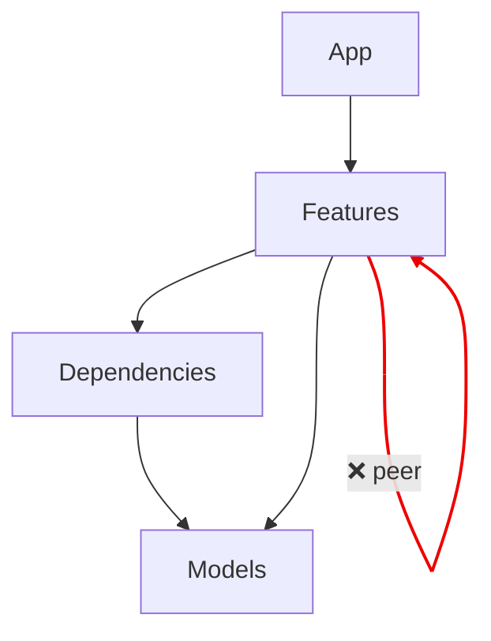
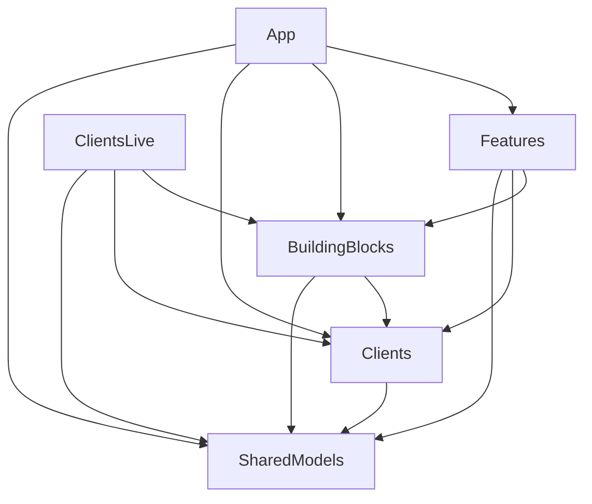

# Integrate into an existing project

Wire SolidLikeARock into Xcode, CI, SwiftPM, Danger, an AI agent, or generate an
architecture graph. New here? Start with the [README](../README.md).

## Xcode — Run Script build phase

Select your app target → **Build Phases** → **+** → **New Run Script Phase**,
then paste:

```bash
if command -v solid-like-a-rock >/dev/null; then
  solid-like-a-rock --config "$SRCROOT/.solid.yml" "$SRCROOT/Sources"
else
  echo "warning: solid-like-a-rock not installed — skipping architecture lint"
fi
```

Because the output uses the `file:line: error:` format, violations show up as
**red errors inline in the editor** and fail the build. Drop the `command -v`
guard if you'd rather make the tool mandatory for everyone.

Xcode will warn that the phase "will be run during every build because it does
not specify any outputs" — that's exactly what you want for a linter. Silence it
by unchecking **"Based on dependency analysis"** on the phase (it then runs every
build, as intended).

Prefer it as a separate, run-on-demand step instead of part of the app build?
Make it a dedicated **aggregate target** (`+` under TARGETS → *Aggregate*) with
the same Run Script phase, and build that scheme to lint.

### Zero-install variant (auto-download a pinned binary)

If you don't want every contributor to install the tool, have the build phase
fetch a pinned release binary into a gitignored cache. Add a
`scripts/lint-architecture.sh` to your repo:

```bash
#!/usr/bin/env bash
set -euo pipefail

VERSION="v0.9.0"
# Universal binary (arm64 + x86_64) since v0.4.2 — no arch detection needed.

ROOT="$(cd "$(dirname "${BASH_SOURCE[0]}")/.." && pwd)"
BIN="$ROOT/.tools/solid-like-a-rock-$VERSION"

if [[ ! -x "$BIN" ]]; then
  mkdir -p "$ROOT/.tools"; tmp="$(mktemp -d)"
  url="https://github.com/nenadvulic/solid-like-a-rock/releases/download/$VERSION/solid-like-a-rock-macos-universal.tar.gz"
  if ! curl -fsSL "$url" -o "$tmp/slr.tar.gz" 2>/dev/null; then
    echo "warning: could not download solid-like-a-rock — skipping architecture lint"; exit 0
  fi
  tar -xzf "$tmp/slr.tar.gz" -C "$tmp"; mv "$tmp/solid-like-a-rock" "$BIN"; chmod +x "$BIN"
fi

exec "$BIN" --config "$ROOT/.solid.yml" "$ROOT/Sources"
```

Then point the Run Script phase at it — `"${SRCROOT}/../scripts/lint-architecture.sh"`
(adjust the relative path to your layout). Add `.tools/` to `.gitignore`.

> Two gotchas: the binary is pinned to a version and cached, so the network is
> only hit once (subsequent builds are offline). And if Xcode's
> `ENABLE_USER_SCRIPT_SANDBOXING` is `YES`, that first download is blocked —
> run the script once from a terminal to seed the cache, or set it to `NO` for
> the target.

## CI — GitHub Action (easiest)

```yaml
- uses: nenadvulic/solid-like-a-rock-action@v1
  with:
    paths: Sources
```

See [solid-like-a-rock-action](https://github.com/nenadvulic/solid-like-a-rock-action) for all inputs (`version`, `config`, `baseline`).

## CI — download the released binary

Each tagged release publishes a prebuilt macOS binary, so CI doesn't pay the
SwiftSyntax build cost:

```yaml
# .github/workflows/architecture.yml
name: Architecture
on: [push, pull_request]
jobs:
  lint:
    runs-on: macos-15
    steps:
      - uses: actions/checkout@v4
      - name: Install solid-like-a-rock
        run: |
          curl -fsSL -o slr.tar.gz \
            https://github.com/nenadvulic/solid-like-a-rock/releases/latest/download/solid-like-a-rock-macos-universal.tar.gz
          tar -xzf slr.tar.gz && sudo mv solid-like-a-rock /usr/local/bin/
      - name: Lint import boundaries
        run: solid-like-a-rock --reporter github --config .solid.yml Sources
```

`--reporter github` emits `::error file=…,line=…::` workflow commands, so each
violation shows up as an **inline annotation** on the pull request (not just in
the log). Reporters: `text` (default, Xcode/CI-friendly `file:line: error:`),
`json` (tooling/Danger), `github` (PR annotations). `--format`/`-f` is a kept alias.

## CI — run from source, nothing to install

If your project is already a SwiftPM package (or you just want it for free in
CI), build and run the tool straight from a checkout — no binary to manage:

```bash
git clone --depth 1 https://github.com/nenadvulic/solid-like-a-rock /tmp/slr
swift run --package-path /tmp/slr solid-like-a-rock --config .solid.yml Sources
```

Either way the non-zero exit code fails the job, so a layer violation blocks the
merge the same way a failing test would.

## SwiftPM command plugin (zero-install)

If your project is a SwiftPM package, add SolidLikeARock as a dependency and run
the bundled **command plugin** — nothing to install, and it works the same
locally and in CI:

```swift
// your Package.swift
dependencies: [
    .package(url: "https://github.com/nenadvulic/solid-like-a-rock", from: "0.9.0"),
],
```

```bash
swift package solid-lint --config .solid.yml Sources
# or, with the conventional layout (.solid.yml at the package root + Sources/):
swift package solid-lint
```

The plugin runs read-only and exits non-zero when violations are found, so it
drops straight into a CI step.

## SwiftPM build-tool plugin (lint on every build)

For SwiftPM targets, apply the **build-tool plugin** to lint automatically as a
prebuild step on every `swift build` (and in Xcode) — violations appear inline,
no separate run-script. It uses a prebuilt binary from the release artifactbundle,
so no compile-from-source cost:

```swift
// your Package.swift
dependencies: [
    .package(url: "https://github.com/nenadvulic/solid-like-a-rock", from: "0.9.0"),
],
targets: [
    .target(
        name: "MyLib",
        plugins: [.plugin(name: "SolidLintBuildTool", package: "solid-like-a-rock")]
    ),
],
```

It reads `.solid.yml` from the package root (or discovers it) and fails the build
on an error-level violation — so a layering regression breaks the build like a
failing test would.

## Danger (comment on the PR diff)

Pass `--format json` to get a machine-readable array instead of the text
diagnostics — ideal for feeding [Danger](https://danger.systems):

```bash
solid-like-a-rock --format json --config .solid.yml Sources
# [ { "file": "...", "line": 5, "module": "NetworkProvider",
#     "layer": "Presentation", "reason": "deniedImport", "message": "..." }, ... ]
```

A ready-to-use **Danger Swift** example lives at
[`examples/Dangerfile.swift`](../examples/Dangerfile.swift). It lints only the
files the PR touches and posts each violation as an inline comment on the exact
line — so contributors are flagged for what they introduce, not for pre-existing
debt. (The exit code still reflects whether violations were found.)

## Claude Code (lint on every AI edit)

When you let an AI agent edit your codebase, the linter only helps if it actually
runs. A [Claude Code](https://docs.claude.com/en/docs/claude-code) **PostToolUse
hook** runs it automatically after the agent touches a `.swift` file and feeds
any violation straight back, so the agent fixes the boundary instead of moving on
— it never decides whether to check. This repository dogfoods the hook on its own
sources.

Copy [`.claude/hooks/solid-lint-changed.sh`](../.claude/hooks/solid-lint-changed.sh)
and [`.claude/settings.json`](../.claude/settings.json) into the consuming project.
See [`.claude/README.md`](../.claude/README.md) for activation, example output, the
`SOLID_BIN` override, and a `Stop`-hook alternative.

## Architecture graph

Generate an always-accurate diagram of your layers straight from the real import
graph — forbidden edges show up red. It renders natively in a GitHub README/PR
(Mermaid) and never goes stale, because it's generated, not drawn.

```bash
solid-like-a-rock graph --config .solid.yml Sources         # Mermaid (default)
solid-like-a-rock graph --format dot Sources | dot -Tsvg > architecture.svg
```

Example — the bundled TCA sample, where one feature imports a sibling feature
(`isolatePeers`), so that edge is flagged red:



And on a real **88-module** app — [isowords](https://github.com/pointfreeco/isowords),
Point-Free's open-source game — a hand-curated layer config collapses the whole
package to its client architecture, every dependency pointing inward:



Regenerate it in CI so the committed diagram always tracks the code — fail the
build if it drifts:

```yaml
# .github/workflows/architecture-graph.yml (excerpt)
- run: |
    solid-like-a-rock graph --config .solid.yml Sources > docs/architecture.mmd
    git diff --exit-code docs/architecture.mmd \
      || { echo "::error::architecture.mmd is stale — regenerate and commit it"; exit 1; }
```
